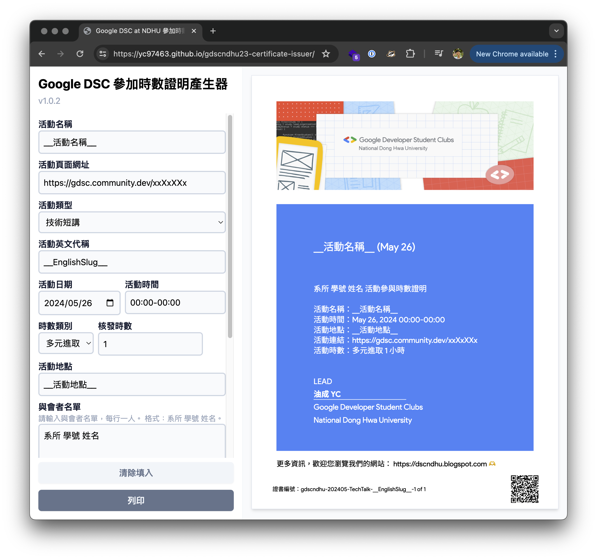

# Google DSC at NDHU 參加時數證明產生器

方便產製社群活動時數證明的小幫手 ><。

## 時數證明產生器

連上 [yc97463.github.io/gdscndhu23-certificate-issuer](https://yc97463.github.io/gdscndhu23-certificate-issuer/) 即可使用。

輸入活動資訊、核發時數，以及與會者名單後，即可產生一份整個活動的時數證明，你可以另存成 PDF 文件。

開發與貢獻請參考 certificate 資料夾內的 [README](certificate/README.md)。

## 切分 script

產生器只能將所有人的證明包在同一個 PDF 裡，所以建議搭配這個 script。

他會將整份文件切成單張證明，並且讀取每一張證明右下角 QR code 內的資訊作為檔案名稱。

請參考 crop 資料夾內的 [README](crop/README.md)。